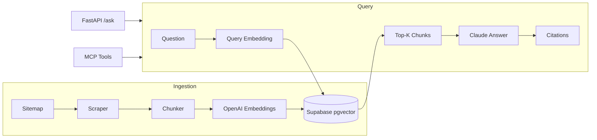

# FastAPI Docs RAG Agent

> **Start here:** [`GETTING_STARTED.md`](GETTING_STARTED.md) — local prototype + Vercel free deploy + exact keys needed.

A documentation Q&A agent over the official [FastAPI](https://fastapi.tiangolo.com) site — built for the Ovidius take-home. It ingests docs into **Supabase + pgvector**, answers with **citations**, exposes a **FastAPI** API, includes a **15-question eval harness**, and ships an **MCP server** (Option C) you can plug into Cursor or Claude Desktop.

## Architecture



## Why these choices

| Decision | Rationale |
|----------|-----------|
| **FastAPI docs** | Public, well-structured sitemap; meta fit since the deliverable is FastAPI; strong eval ground truth |
| **Supabase + pgvector** | Matches your production stack; `match_doc_chunks` RPC keeps retrieval in SQL |
| **OpenAI embeddings** | Fast to ship, 1536-dim aligns with schema; swap to Voyage/Cohere in prod |
| **Claude for answers** | Anthropic-native generation; eval uses same stack for LLM-as-judge |
| **Option C — MCP** | Demonstrates tool schemas + works in Cursor without a separate UI build |

### Tradeoffs (honest)

- **Ingestion**: HTML scrape (~60 pages), not official llms.txt — good enough for demo; production would use sitemap + incremental refresh + dedup.
- **IVFFlat index**: Fine for thousands of chunks; at scale switch to HNSW and re-tune `lists`.
- **Embeddings provider**: OpenAI for speed; if you standardize on Voyage at Ovidius, re-embed once and alter vector dimension in schema.

## Prerequisites

- Python 3.11+
- [Supabase](https://supabase.com) project (free tier OK)
- `OPENAI_API_KEY` (embeddings)
- `ANTHROPIC_API_KEY` (answers + optional judge)

## Setup (≈15 min)

### 1. Clone and install

```bash
cd Nisarg
python3 -m venv .venv
source .venv/bin/activate
pip install -r requirements.txt
cp .env.example .env
# Edit .env with your keys
```

### 2. Supabase schema

In Supabase Dashboard → **SQL Editor**, run [`sql/schema.sql`](sql/schema.sql).

### 3. Ingest documentation

```bash
python -m src.ingest
# Re-ingest from scratch:
python -m src.ingest --clear
```

Expect ~60 pages → ~400–800 chunks depending on content length.

### 4. Run the API

```bash
uvicorn src.api:app --reload --port 8000
```

- Health: http://127.0.0.1:8000/health  
- Interactive docs: http://127.0.0.1:8000/docs  
- Ask:

```bash
curl -X POST http://127.0.0.1:8000/ask \
  -H "Content-Type: application/json" \
  -d '{"question": "How do I declare path parameters?"}'
```

### 5. Run evaluation

```bash
# Retrieval only (fast, no generation cost)
python eval/run_eval.py --k 5

# Retrieval + LLM judge on 5 samples
python eval/run_eval.py --k 5 --judge --judge-sample 5
```

Target on a healthy index: **Hit@5 ≥ 80%**, **MRR ≥ 0.5**. Tune `TOP_K`, chunk size, or ingest more pages if below.

Results written to `eval/results.json`.

## MCP server (Option C)

Four tools with typed inputs:

| Tool | Purpose |
|------|---------|
| `search_docs` | Raw semantic retrieval (JSON) |
| `ask_docs` | Full RAG answer + citations |
| `format_citations` | Markdown source list for users |
| `kb_status` | Index health |

### Cursor

Add to `.cursor/mcp.json` (see [`mcp_config.example.json`](mcp_config.example.json)):

```json
{
  "mcpServers": {
    "fastapi-docs-kb": {
      "command": "/Users/you/Nisarg/.venv/bin/python",
      "args": ["-m", "src.mcp_server"],
      "cwd": "/Users/you/Nisarg",
      "env": { "...": "from .env" }
    }
  }
}
```

Restart Cursor → ask: *"Use ask_docs: how does CORS work in FastAPI?"*

### Claude Desktop

Same pattern under `claude_desktop_config.json` → `mcpServers`.

## Project layout

```
Nisarg/
├── sql/schema.sql          # pgvector table + match RPC
├── src/
│   ├── ingest.py           # CLI ingestion
│   ├── scraper.py          # Sitemap + HTML extract
│   ├── chunking.py
│   ├── embeddings.py
│   ├── vector_store.py     # Supabase client
│   ├── rag.py              # Retrieve + generate + citations
│   ├── api.py              # FastAPI service
│   └── mcp_server.py       # MCP (Option C)
├── eval/
│   ├── dataset.json        # 15 golden Q&A pairs
│   └── run_eval.py         # Hit@k, P@k, MRR, LLM judge
└── scripts/demo.sh
```

- Multi-tenant collections per customer docs site

## License

MIT — built as a take-home demonstration.
